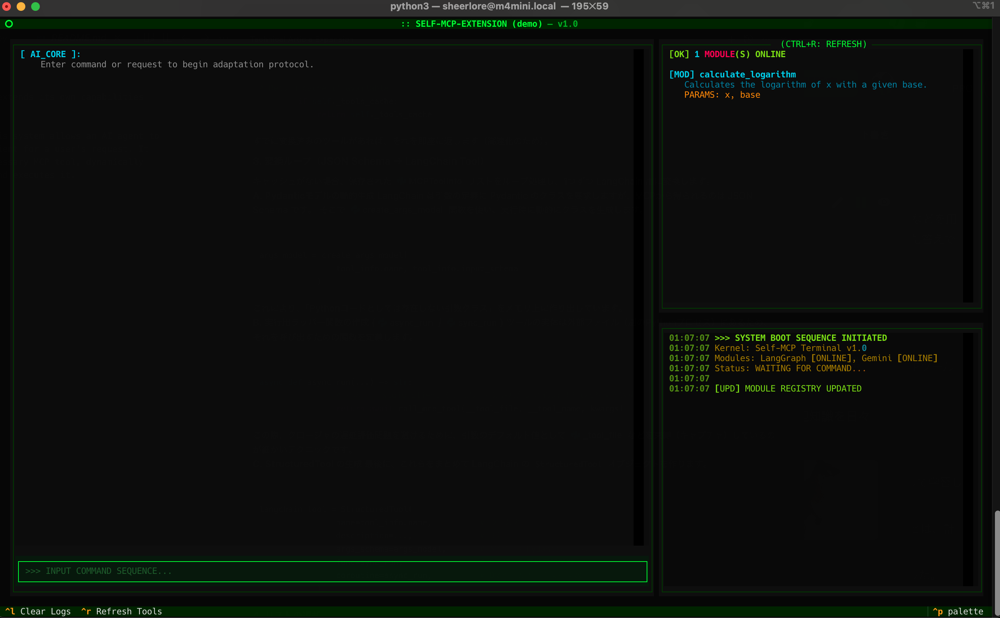

# Self-MCP Extension



An experimental system where AI autonomously extends its own capabilities (MCP tools) through user interaction.

Built on the Model Context Protocol (MCP), this system allows an AI agent to recognize when its current tools are insufficient for a user's request. It then instantly generates the code for the necessary MCP tool, dynamically installs/registers it into its own toolset, and executes it.

## Usage

```bash
uv run app.py
```

## License
MIT
